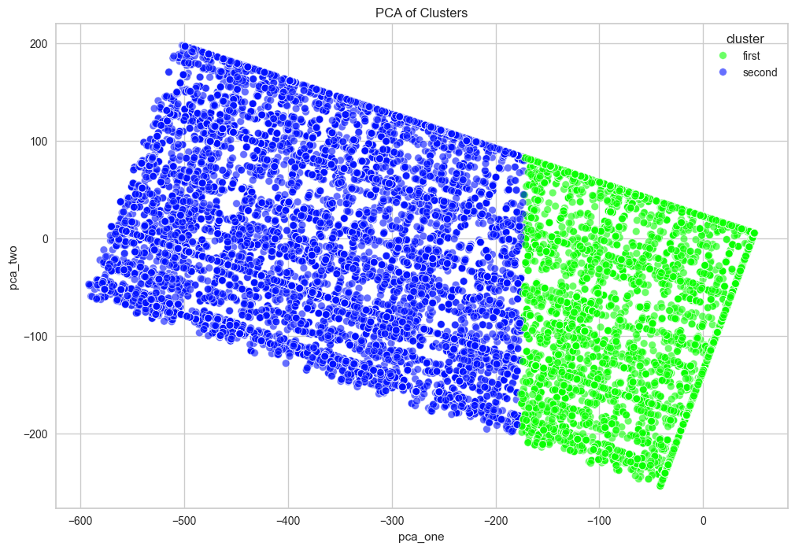
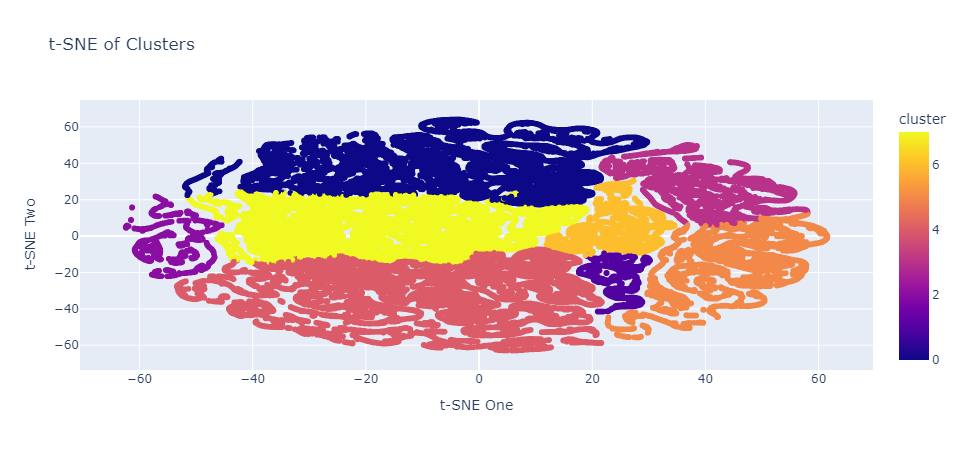

# **Sauti East Africa Customer Segmentation Analysis**

Sauti East Africa, a non-profit social enterprise, focuses on improving the livelihoods of traders and farmers, and particularly women, in East Africa. They provide them with realtime market data through access to online digital resources. Sauti collect demographic data on these traders solutions, but never had a way to visualize the demographic data for researchers.

---

## 📝 **Table of Contents**
- [📖 **Project Description**](#project-description)
- [🌟 **Requirements**](#requirements)
- [⚙️ **Installation**](#installation)
- [**Usage**](#usage)
- [**Project Structure**](#project-structure)
- [**Results**](#results)
- [**Contributing**](#contributing)
- [📜 **License**](#license)
- [👩‍💻 **Acknowledgements**](#acknowledgements)

---

# 📖 **Project Description**

Sauti has requested the Miller Center team to perform limited aggregate analysis of all of our user's behavior - on a project evaluation basis. Better understanding our user's interactions will allow Sauti to better optimize their menu design and explore the feasibility of smart menus based on user predicted behavior.

## **Cluster Segmentation Model**

The setup and structure of the clustering segmentation model was used in this project to identify distinct user segments based on demographic data and interaction behavior sourced from the Sauti platform. Sauti offers a range of information services to users in Kenya, Uganda, Rwanda, and Tanzania via a cellular network. Users access these services by dialing a shortcode and navigating through numbered menus. The platform, available in multiple languages, updates hourly with current information covering:
- Market Prices
- Virtual Marketplace
- Currency Exchange Rates
- Weather Forecasts
- Trade and Tax Information
- Financial Management Services
- Agricultural Services
- Business Operations Information
- Legal and Anti-Corruption Information
- COVID-19 Updates
- Health Information
- Corruption Reporting

Sauti aims to bridge information gaps for micro, small, and medium enterprises (MSMEs), enhancing access to timely information. A clustering segmentation model can better assist Sauti's team in understanding their diverse user base and tailoring services to meet the specific needs of different market segments.

## **Methodology** 
1. **Data Transformation:**
    - Sentence Embeddings: User demographic data is converted into text representations using the Sentence Transformer model.
    - The following features are included in the text representation:
        - Age
        - Border
        - Occupation
        - Gender
        - Education
        - Crossing Frequency
        - Produce
        - Commodity Product
        - Commodity Market
        - Language
        - Procedure Destination
        - Country Code

2. **Embedding Generation:**
    - **Sentence Transformer Model:** The text representations are encoded into dense numerical embeddings using the `sentence-transformers/paraphrase-MiniLM-L3-v2` model. 
        - Tansform the categorical demographic data into a high-dimensional numeric format suitable for clustering.
        - **Optimal Batch Size:** Embeddings are generated with an optimal batch size to ensure efficient processing.

3. **Clustering Algorithm:**
    - **KMeans Clustering:** The KMeans algorithm is applied to the sentence embeddings to identify distinct user segments.
    - **Number of Clusters:** The optimal number of clusters is determined through experimentation, aiming to balance within-cluster similarity and between-cluster distinctiveness.

4. **Cluster Assignment:**
    - Each user is assigned to one of the identified clusters based on the similarity of their embeddings to the cluster centroids.
    - The cluster labels are added to the original dataset for further analysis and visualization.

5. **Dimensionality Reduction and Visualization:**
    - **PCA (Principal Component Analysis):** Reduces the dimensionality of the data to two principal components for initial visualization and interpretation.
    - **t-SNE (t-Distributed Stochastic Neighbor Embedding):** Provides a non-linear dimensionality reduction to visualize local structures and relationships in the data.

---

# 🌟 **Requirements**

## **Prerequisites**
- Python 3.7 or higher
- Pandas
- NumPy
- Scikit-learn
- Matplotlib
- Datetime
- Plotly
- SHAP

```bash
pandas==1.2.3
matplotlib==3.3.4
seaborn==0.11.1
geopy==2.1.0
pydrive==1.3.1
plotly==4.14.3
scipy==1.6.0
numpy==1.19.5
```

---

# ⚙️ **Installation**

1. Clone the repository and install the necessary dependencies.
```bash
git clone https://github.com/Jchow2/python-market-segmentation-analysis.git
cd python-market-segmentation-analysis
pip install -r requirements.txt
```
2. Change to the project directory:
```bash
cd python-market-segmentation-analysis
```
3. Install the required Python packages:
```bash
pip install -r requirements.txt
```

---

# **Usage**

To start the market segmentation analysis, run the relevant scripts as outlined below:

1. **Data Preparation:** Prepare and clean the data using the `data_preparation.py` script:

```bash
python src/data_preparation.py
```

2. **Feature Engineering:** Perform feature engineering and transformation using the `feature_engineering.py` script

```bash
python src/feature_engineering.py
```

3. **Clustering Analysis:** Run the clustering analysis using the `clustering_analysis`.py script

```bash
python src/clustering_analysis.py
```

4. **Cluster Visualizations:** Visualize the clustering results using the pca_visualization.py and tsne_visualization.py scripts:

```bash
python src/pca_visualization.py
python src/tsne_visualization.py
```

5. **Classification Model Evaluation:** Evaluate the classification model using the `classification_model.py` script

```bash
python src/classification_model.py
```

The results, including visualizations and data analysis, will be generated and saved in the appropriate directories.

---

# **Project Structure**

```bash
/project-root
    ├── data                     # Directory for raw and processed data
    │   ├── raw                  # Raw data files
    │   ├── processed            # Processed data files
    ├── notebooks                # Jupyter notebooks for exploration and analysis
    │   ├── sauti-exploratory-data-analysis.ipynb  # Notebook for exploratory data analysis
    ├── src                      # Source code for the project
    │   ├── data_preparation.py  # Script for data preparation and cleaning
    │   ├── feature_engineering.py # Script for feature engineering and transformation
    │   ├── clustering_analysis.py # Script for clustering analysis
    │   ├── classification_model.py # Script for classification model evaluation
    │   ├── pca_visualization.py  # Script for PCA visualization
    │   ├── tsne_visualization.py  # Script for t-SNE visualization
    │   ├── utils.py             # Utility functions for the project
    ├── tests                    # Directory for test scripts
    │   ├── test_data_preparation.py # Test script for data preparation
    │   ├── test_feature_engineering.py # Test script for feature engineering
    │   ├── test_clustering_analysis.py # Test script for clustering analysis
    │   ├── test_classification_model.py # Test script for classification model
    ├── results                  # Directory to save results and visualizations
    ├── README.md                # Project README file
    ├── requirements.txt         # List of dependencies
```

---

# **Result**

## **PCA of Clusters**



The PCA plot shows how the data points (traders and farmers) are distributed in the new coordinate system. Clusters in the PCA plot indicate groups of data points that are similar to each other. The separation between clusters suggests distinct segments within the data.

- **Clusters**: There are two distinct clusters of data points, one colored blue and labeled `"second"` and the other colored green and labeled `"first"`.
- **Separation**: The clusters are well-separated, indicating that the PCA has effectively reduced the dimensionality of the data while preserving the separation between the clusters.
- **Cluster Density**: Both clusters are densely packed, indicating that the data points within each cluster are similar to each other.
- **Cluster Size**: The blue cluster appears to be larger than the green cluster, suggesting that there are more data points in the `"second"` group compared to the `"first"` group.

## **t-SNE of Clusters**



In this project, we use t-Distributed Stochastic Neighbor Embedding (t-SNE) to visualize clusters in a lower-dimensional space, enhanced by first applying Principal Component Analysis (PCA) to reduce dimensionality. This combination leverages PCA to preserve global structure and t-SNE to capture local relationships, providing a detailed visualization of similar data point groups.

- **Clusters**: The t-SNE plot shows distinct clusters, indicating clear groupings within the data.
- **Cluster Separation**: The clear separation suggests that t-SNE has effectively identified distinct groups, crucial for understanding different segments of traders and farmers.
- **Cluster Density**: Densely packed clusters indicate that data points within each cluster share similar characteristics or behaviors.
- **Cluster Size**: Varying cluster sizes suggest differences in the number of data points within each group, providing insights into the distribution of traders and farmers. Larger clusters may indicate more prevalent segments.

# **Contributing**

We welcome contributions to this project! If you would like to contribute, please follow these steps:

```bash
1. Fork the repository.
2. Create a new branch (`git checkout -b feature-branch`).
3. Make your changes and commit them (`git commit -m 'Add new feature'`).
4. Push to the branch (`git push origin feature-branch`).
5. Open a pull request.
```

Please ensure that your code adheres to our coding standards and includes appropriate tests. Thank you for your contributions!

# **License**
This project is licensed under the MIT License.

# **Acknowledgements**

We would like to thank the following individuals and organizations for their support and contributions to this project:

- **Contributors**: Justin Chow, Kyle Kehoe, Anoushka Nayah, Priyansha Rastogi
- **Organizations**: Sauti East Africa, Miller Center of Social Entrepreneurship, Santa Clara University
- **Tools and Libraries**: We are grateful to the Sauti developers of the Sauti Platform Demonstration that made this project possible: [Interactive Demo](https://www.sautiafrica.org/sauti-services-products/sauti-trade-market-info-platform-demo/)
- **Mentors and Advisors**: Special thanks to Lance Hadley, CEO of Sauti East Africa for his guidance and advice.
- **Community**: We appreciate the support and feedback from the Santa Clara University MS of Business Analytics community.

Your contributions and support have been invaluable to the success of this project.
